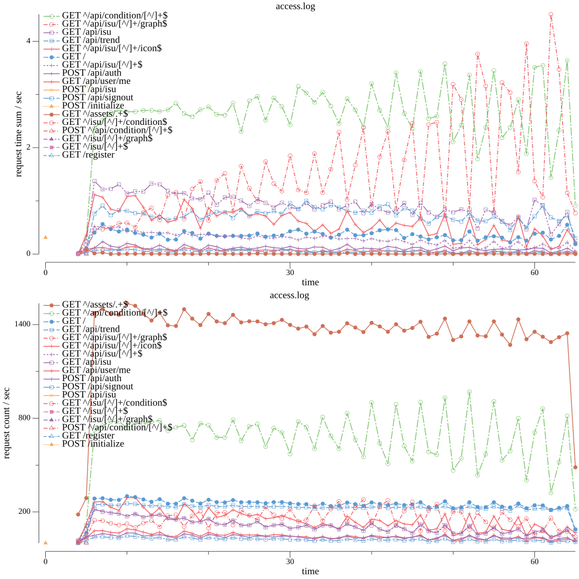

# ngraphinx
nginxのaccess.logを時系列のグラフにするcliツール

## install
`go install github.com/aokabi/ngraphinx@latest`

## usage
### image
`ngraphinx image --path="./sample-accesslog/access.log" --aggregates="/isu/*,/api/condition/*,/?jwt"`

### chartjs
`ngraphinx chartjs --path="./sample-accesslog/access.log" --aggregates="/isu/*,/api/condition/*,/?jwt"`

## contribution
welcome!
